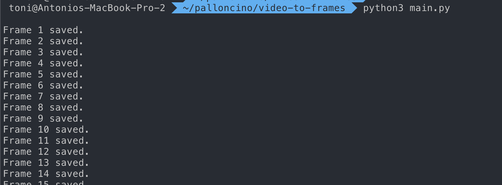

# SIMPLE Video to sequence of images

### How Sir?
- Download your video
- Place it in the root
- Make sure you have output_images folder in the root (won't be generated automatically)
- run ```python main.py``` from root. This script will place the images inside the folder.


